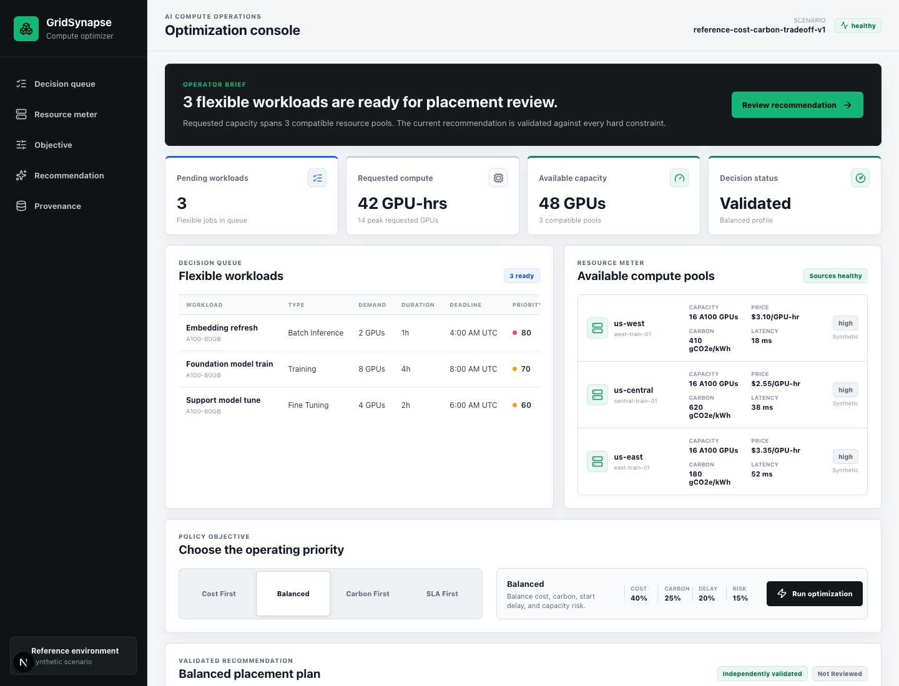

# GridSynapse v2

GridSynapse is a buyer-side AI compute procurement control plane. It evaluates where and when queued GPU workloads can run, turns the selected placement into an approval-grade compute commitment, generates an inspectable SkyPilot planning artifact, and records the outcome for reconciliation.

This repository contains a working product foundation, not a marketing-only dashboard:

- typed scenario, workload, resource, recommendation, and approval contracts;
- deterministic baseline construction;
- constraint-based optimization with OR-Tools CP-SAT;
- independent post-solve validation;
- no-key live adapters for SkyPilot's public GPU catalog and the official NESO GB carbon forecast;
- a FastAPI service with explanations, approvals, exports, and metrics;
- optional Supabase persistence for recommendations, reviews, and decision history;
- typed procurement plans, offer snapshots, verification records, and reconciliation receipts;
- inspectable SkyPilot manifests and a complete zero-spend lifecycle simulation;
- a Next.js operator workflow organized as Queue, Decision, Procurement, Runs, and Outcomes;
- reproducible reference evidence and a fixed solver-latency benchmark.



## What The Product Demonstrates

1. **Queue.** See what must run, when it is due, and the hard constraints GridSynapse must protect.
2. **Decision.** Compare validated placement options using current public price evidence and clearly labeled modeled capacity.
3. **Procurement.** Approve one exact input hash, create a spend-capped compute commitment, generate its SkyPilot manifest, and verify every safety check.
4. **Runs.** Exercise provisioning, running, and completion states through a deterministic zero-spend simulation.
5. **Outcomes.** Reconcile the approved estimate against a simulated actual and retain the decision evidence.

The portfolio build never contacts a provider, reserves inventory, or creates a billable resource. It proves the workflow and activation boundary without pretending public catalog prices are executable quotes.

## Live Market Inputs

The default console requests a hybrid live scenario before falling back to the checked-in reference case:

- **Pricing:** A100-80GB catalog prices from the open [SkyPilot cloud catalog](https://github.com/skypilot-org/skypilot-catalog), which is refreshed by the project throughout the day. Catalog prices are comparison inputs, not a guarantee of inventory or an executable quote.
- **Carbon:** the official, unauthenticated [NESO Carbon Intensity API](https://carbon-intensity.github.io/api-definitions/) supplies the 30-minute Great Britain forecast. Regions without a no-key authoritative feed are explicitly labeled as low-confidence planning estimates.
- **Capacity, latency, and availability:** intentionally modeled until provider credentials and inventory APIs are connected. They are never labeled as live.

The API caches a successful market snapshot for 30 minutes and drops an unavailable provider from the comparison. If fewer than two current catalog entries are available, the console falls back to the clearly labeled synthetic reference scenario.

## Reference Result

The checked-in reference scenario is intentionally small and synthetic. It exists to prove the decision path and show that different objectives produce different defensible outcomes.

| Profile | Cost vs baseline | Emissions vs baseline | Delay change | Validation |
| --- | ---: | ---: | ---: | --- |
| Cost | -13.52% | +40.97% | 0 min | Passed |
| Balanced | +6.14% | -43.59% | 0 min | Passed |
| Carbon | +8.06% | -57.21% | 0 min | Passed |
| SLA | +6.14% | -43.59% | 0 min | Passed |

These are outputs from `data/scenarios/reference-scenario.json`, not claims about production savings. Regenerate them with:

```bash
.venv/bin/python scripts/generate_reference_evidence.py
```

The complete machine-readable result is in [`evidence/reference-profile-results.json`](evidence/reference-profile-results.json).

## Architecture

```text
Next.js operator console (apps/web)
            |
            v
FastAPI workflow API (services/api)
      |                |
      v                v
typed adapters     grounded explanations
      |                    |
      v                    v
contracts -> baseline -> CP-SAT optimizer -> independent validator
                                                |
                                                v
                          approved compute commitment
                         -> SkyPilot manifest -> verification
                         -> simulated lifecycle -> reconciliation
```

The optimizer is deterministic for a fixed request: one solver worker, a fixed seed, stable candidate ordering, and canonical input hashing. The API uses Supabase when backend credentials are configured and falls back to process memory for local evaluation. The console makes the active persistence mode visible so an operator is never led to believe a session-only review was stored durably.

### Preview Safe Mode

Commit-linked previews must not share durable writes with production. Set these variables in
the Vercel Preview environment or any temporary review runtime:

```bash
GRIDSYNAPSE_PREVIEW_SAFE_MODE=true
GRIDSYNAPSE_EXECUTION_ENABLED=false
```

Preview Safe Mode ignores Supabase credentials even if they are present, keeps recommendations,
approvals, and procurement workflow state inside the API process, and forces provider execution
off. Public catalog and demo scenario reads remain available. The `/health` response reports
`previewSafeMode: true`, `durableWritesEnabled: false`, and `executionEnabled: false` so the
boundary can be verified without trusting configuration. Production behavior is unchanged when
`GRIDSYNAPSE_PREVIEW_SAFE_MODE` is false or unset.

## Durable Decision History

Apply [`supabase/migrations/202607180001_gridsynapse_persistence.sql`](supabase/migrations/202607180001_gridsynapse_persistence.sql) to a dedicated Supabase project, then configure the API with backend-only credentials:

```bash
SUPABASE_URL=https://your-project.supabase.co
SUPABASE_SECRET_KEY=your-backend-secret-key
```

The secret key must never be exposed to the browser. The migration enables row-level security, removes access for `anon` and `authenticated`, grants the backend role access to recommendation records, and limits decision events to append-only writes plus reads. Without both variables, GridSynapse runs in clearly labeled session-memory mode.

## Quick Start

Prerequisites:

- Python 3.12+
- Node.js 22+

Install:

```bash
python3 -m venv .venv
.venv/bin/python -m pip install --upgrade pip
.venv/bin/python -m pip install -e ".[dev]"
cd apps/web && npm ci
```

Run the API from the repository root:

```bash
PYTHONPATH=packages/contracts:packages/optimizer:packages/adapters:packages/explanations:packages/procurement:services/api \
  .venv/bin/python -m uvicorn app.main:app --host 127.0.0.1 --port 8080
```

Run the console in a second terminal:

```bash
cd apps/web
npm run dev
```

Open:

- Operator console: `http://127.0.0.1:3020`
- OpenAPI: `http://127.0.0.1:8080/docs`
- Prometheus metrics: `http://127.0.0.1:8080/metrics`

Equivalent shortcuts are available as `make v2-api`, `make v2-web`, and `make v2-check`.

## API Surface

| Method | Endpoint | Purpose |
| --- | --- | --- |
| `GET` | `/health` | Service health |
| `GET` | `/metrics` | Prometheus metrics |
| `GET` | `/api/v2/scenarios` | Scenario inventory |
| `GET` | `/api/v2/live-market/scenario` | Hybrid live catalog, carbon, and provenance snapshot |
| `GET` | `/api/v2/scenarios/{id}` | Typed scenario |
| `GET` | `/api/v2/scenarios/{id}/data-health` | Source freshness and confidence |
| `POST` | `/api/v2/scenarios/validate` | Contract validation summary |
| `POST` | `/api/v2/optimizations` | Baseline, optimize, and validate |
| `GET` | `/api/v2/optimizations/{id}/explanation` | Grounded operator explanation |
| `POST` | `/api/v2/optimizations/{id}/approval` | Approve or request revision |
| `GET` | `/api/v2/optimizations/{id}/export` | JSON or CSV evidence export |
| `GET` | `/api/v2/decision-history` | Recent recommendations and operator review states |
| `POST` | `/api/v2/procurement/plans` | Create a spend-capped commitment from an approved recommendation |
| `GET` | `/api/v2/procurement/plans/{id}` | Read the commitment, manifest, and current lifecycle state |
| `POST` | `/api/v2/procurement/plans/{id}/verify` | Verify hashes, evidence freshness, spend, approval, and execution locks |
| `POST` | `/api/v2/procurement/plans/{id}/transitions` | Exercise simulation-only lifecycle and reconciliation transitions |

## Verification

Run the full v2 gate:

```bash
make v2-check
```

That command checks formatting and linting, runs Python tests, type-checks and builds the web app, and enforces the fixed benchmark gate.

The benchmark scenario contains 100 jobs, 6 resource pools, and 96 half-hour slots. On the development machine recorded in the latest local evidence run, p95 end-to-end `optimize(request)` latency was **140.46 ms** across 8 measured runs. The threshold is an engineering regression gate, not a production SLA. See [`evidence/README.md`](evidence/README.md) for method and limitations.

## Containers

The v2 stack is isolated from the legacy compose configuration:

```bash
docker compose -f docker-compose.v2.yml up --build
```

This starts the API on port `8080` and the operator console on port `3020`.

## Boundaries

- Checked-in reference inputs are synthetic and labeled as such; the live market endpoint identifies every input at the metric level.
- Portfolio mode generates executable-format manifests but does not provision or migrate workloads.
- Carbon values depend on the supplied intensity data and are reported as estimates.
- Price, latency, availability, and capacity are only as trustworthy as their source metadata.
- Approval is human-controlled, and any input change should invalidate a prior decision in a production implementation.
- Procurement plans and lifecycle transitions are session-scoped in the portfolio API; recommendation and approval history can be persisted to Supabase.
- Paid execution remains structurally disabled. Activation requires credentialed provider access, account-specific price and inventory checks, durable procurement storage, RBAC, approval policy, a backend spend ceiling, and an authorized provider adapter. See [`docs/v2/PROVIDER_ACTIVATION.md`](docs/v2/PROVIDER_ACTIVATION.md).

## Legacy Reference

The original dashboard remains in `infra/dashboard-v2.html` as a visual and historical reference. GridSynapse v2 is implemented separately in `apps/web`, `services/api`, and `packages` so the legacy files are preserved.

Detailed product, architecture, and evidence notes are in [`docs/v2`](docs/v2/README.md).
